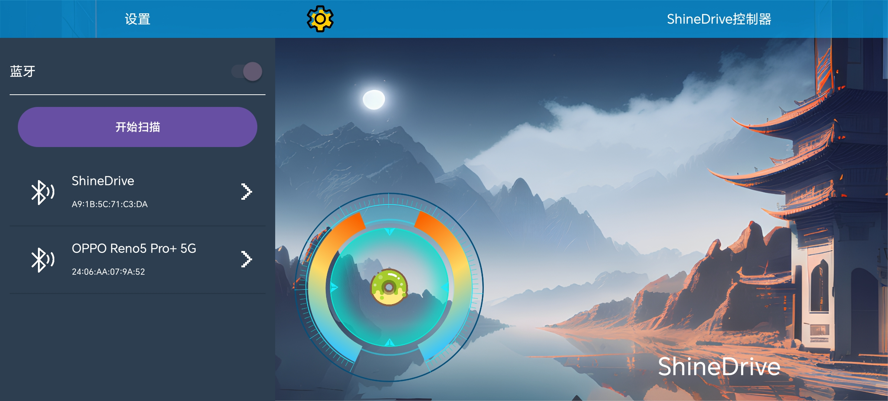

# ShineDrive

#### 介绍
AndroidStudio开发的低功耗蓝牙遥控器，适用于RC6621A及其UUID为如下的低功耗蓝牙设备
| 名称 | UUID |
|------|------|
| SERVICES_UUID | 6E400001-B5A3-F393-E0A9-E50E24DCCA9E |
| WRITE_UUID    | 6E400002-B5A3-F393-E0A9-E50E24DCCA9E |
| NOTIFY_UUID   | 6E400003-B5A3-F393-E0A9-E50E24DCCA9E |

#### 启动界面

#### 主界面

#### 蓝牙列表
